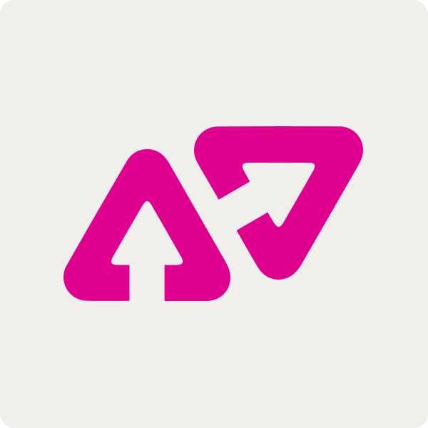
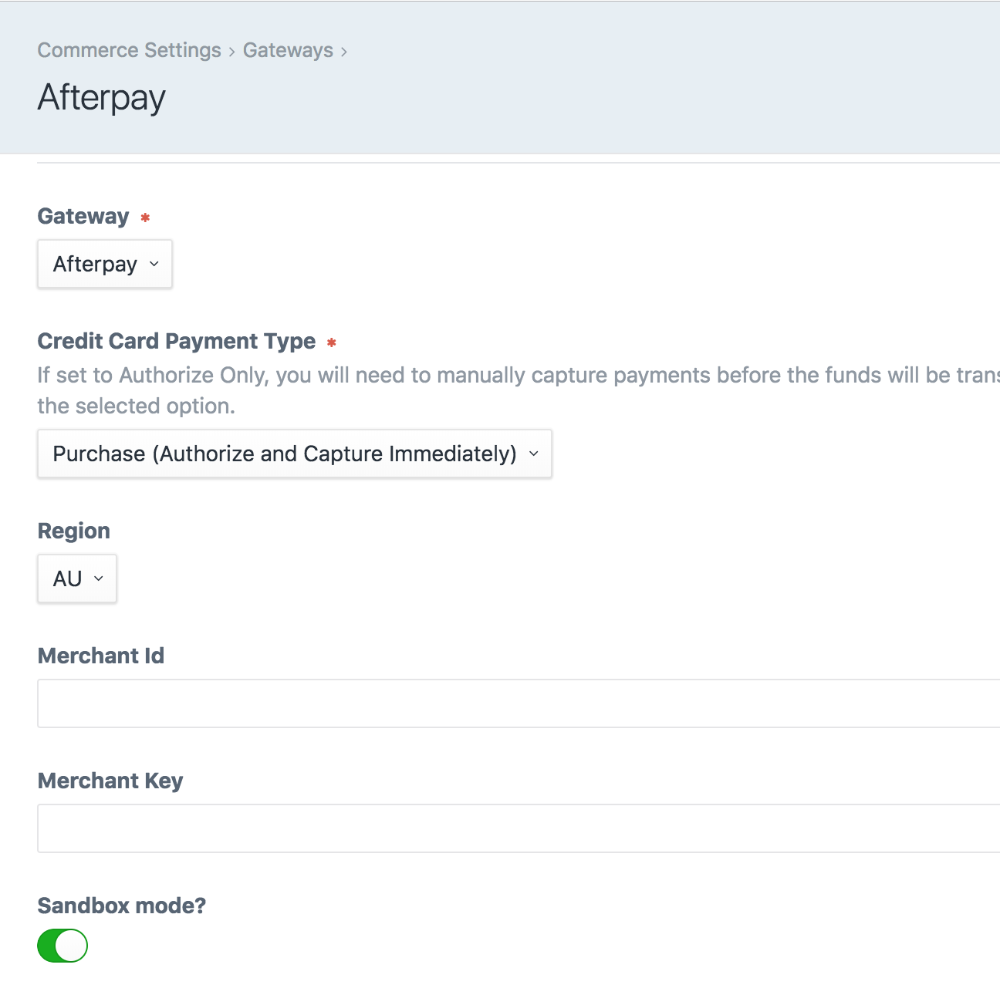
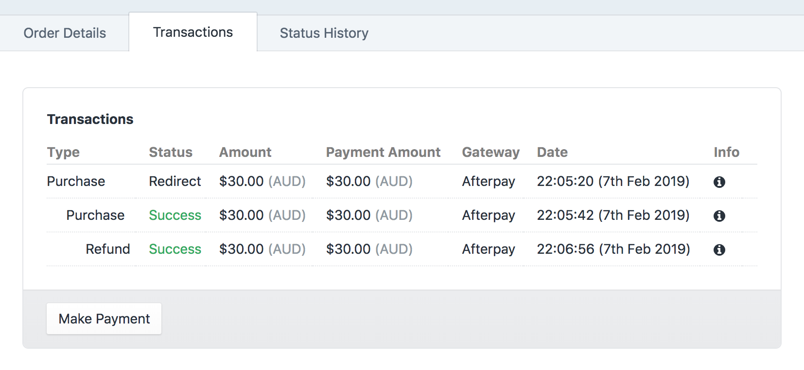

<h1 align="center">Afterpay plugin for Craft Commerce</h1>

This plugin provides an [Afterpay](https://www.afterpay.com/en-AU/index) gateway for [Craft Commerce v2.x](https://craftcms.com/commerce).

## Features

* AU, NZ and US Regions (AU tested, NZ and US Pending SAT)
* Full and Partial refund support
* Authorisation and Total mismatch detection (passes Afterpay SAT)
* User-Agent headers (passes Afterpay SAT)
* Excellent Afterpay API response debugging
* Native Commerce 2 Integration (no OmniPay abstraction)

## Screenshots

## Requirements

This plugin requires Craft CMS 3.1 or later and Craft Commerce 2.0 or later.

## Installation

### Plugin Store

To install `Afterpay for Craft Commerce 2`, navigate to the Plugin Store section of your Craft control panel, 
search for `Afterpay for Craft Commerce 2`, and click the Try button.

### Composer

You can also add the package to your project using Composer.

1. Open your terminal and go to your Craft project:

        cd /path/to/project

2. Then tell Composer to load the plugin:

        composer require newism/commerce-afterpay

3. In the Control Panel, go to Settings → Plugins and click the “Install” button for Afterpay.

## Configuring Afterpay

First you'll need to setup a merchant account. This can be done by [emailing Afterpay](https://www.afterpay.com/en-AU/merchant-enquiry).

Once you have a merchant account you'll be provided with a `Merchant ID` and `Merchant Key`. 

To add the Afterpay payment gateway, go to Commerce → Settings → Gateways, create a new gateway, and set the gateway type to “Afterpay”.

You may then decide to configure your Afterpay gateway using a [config file](https://docs.craftcms.com/commerce/v2/gateway-config.html#gateway-configuration). An example file looks like:

    <?php
    return [
        'afterpayGatewayHandle' => [
            'sandboxMode' => getenv('AFTERPAY_SANDBOX_MODE'),
            'merchantId' => getenv('AFTERPAY_MERCHANT_ID'),
            'merchantKey' => getenv('AFTERPAY_MERCHANT_KEY'),
            // Must be 'AU', 'NZ' or 'US'
            'region' => getenv('AFTERPAY_REGION'),
        ],
    ]; 

### Currency Support

Afterpay only supports one currency per region. Due to this limitation stores must set their base currency to match their Afterpay account region. Payments will be processed in the base currency.

| Region | Currency | Docs                                                         |
| ------ | -------- | ------------------------------------------------------------ |
| AU     | AUD      | https://docs.afterpay.com/au-online-api-v1.html#money-object |
| NZ     | NZD      | https://docs.afterpay.com/nz-online-api-v1.html#money-object |
| US     | USD      | https://docs.afterpay.com/us-online-api-v1.html#money-object |

## Support

### GitHub

If you've found a bug, or would like to make a feature request, head to the [GitHub Repo](https://github.com/newism/commerce-afterpay/issues) and file an issue. Pull requests are also most welcome!

### Twitter

Get our attention on Twitter by using the `#craftcms` hashtag and mentioning [@newism](https://twitter.com/newism)

### Stack Exchange

Ask a question via the [Craft Stack Exchange](http://craftcms.stackexchange.com/) and tag your question with `plugin-newism-commerce-afterpay`.

### Email

Any feedback, comments, questions or suggestions please email us at `support at newism.com.au`.

## Licensing

You can try this plugin in a development environment for as long as you like.

For more information, see [Craft's Commercial Plugin Licensing](https://docs.craftcms.com/v3/plugins.html#commercial-plugin-licensing).

----

Brought to you by [Newism](https://newism.com.au)
